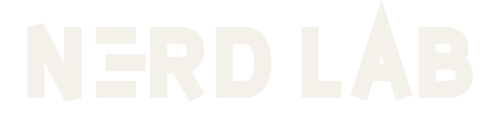

<div align="center">

<picture>
  <source media="(prefers-color-scheme: dark)" srcset="assets/logo/nerd-lab-offwhite.svg">
  <source media="(prefers-color-scheme: light)" srcset="assets/logo/nerd-lab-ink.svg">
  
</picture>

**Unnecessarily clever. Occasionally useful.**

</div>

The source of the Nerd Lab landing page.

**Live:** https://nerd-factory.github.io/nerd-lab/

## What this repo is

One HTML file, one stylesheet, one small script, and the brand assets. No framework, no
bundler, no build step. `git clone` and open it — what you see locally is what ships.

The rest of the lab is at [github.com/nerd-factory](https://github.com/nerd-factory), which
also hosts [unaiverse](https://github.com/nerd-factory/unaiverse) — a fork rather than a
transfer, deliberately: the live site at https://mafiatun.github.io/unaiverse stays the
canonical address, and transferring would have killed that URL without a redirect.
If you are looking for a way in rather than a way to fix the CSS, start at
[Discussions](https://github.com/nerd-factory/nerd-lab/discussions).

## Running it

```bash
git clone https://github.com/nerd-factory/nerd-lab.git
cd nerd-lab
python3 -m http.server 8000
```

Then open http://localhost:8000. Open it as a `file://` URL and the video will still
play, but treat the http server as the honest test.

## Layout

```
index.html                     the whole page
assets/css/site.css            the whole design system
assets/js/site.js              autoplay guard, tab-visibility pause, console easter egg
assets/logo/                   wordmark in volt / off-white / ink, plus the nudged-E mark
assets/video/                  the 28-second title sequence, 7.2 MB
assets/poster/                 the video's poster frame
.github/workflows/deploy.yml   builds nothing, publishes everything, on push to main
```

## Brand

| Token | Value | Used for |
|---|---|---|
| ink | `#141419` | every background |
| off-white | `#F4F1EA` | every piece of body text — 16.3:1 on ink |
| volt | `#C8F531` | interactive states and exactly one accent element — 14.5:1 on ink |
| muted | `#9A9996` | secondary text and debug annotations — 6.4:1 on ink |

Monochrome plus one accent. The wordmark is the supplied SVG recoloured, never redrawn,
and the page must still read correctly with the accent removed entirely. There is no
second accent colour waiting in the wings, and the answer to "can we add one" is no.

Typography is a system stack that leans geometric — Futura, then Avenir Next, then
Century Gothic, then whatever the platform offers. Nothing is downloaded at runtime.

## Deployment

Push to `main`. The workflow checks that `index.html`, `.nojekyll`, and the video are
present and that no root-relative paths have crept in — those would 404 the moment the
site is served from a subpath — then publishes the directory to GitHub Pages.

## Known gaps

- The title sequence audio is a scratch mix: TTS dialogue over a synthesised temp bed.
  The video is muted by default because of this. It needs a real mix and a captions
  track before the media is WCAG-complete.
- `experiment-002` and `experiment-003` are placeholders. They are meant to be replaced
  by real things, not to become a running joke.

## Licence

[MIT](LICENSE). See [CONTRIBUTING.md](CONTRIBUTING.md) for how to join in, and
[CODE_OF_CONDUCT.md](CODE_OF_CONDUCT.md) for the one rule.
